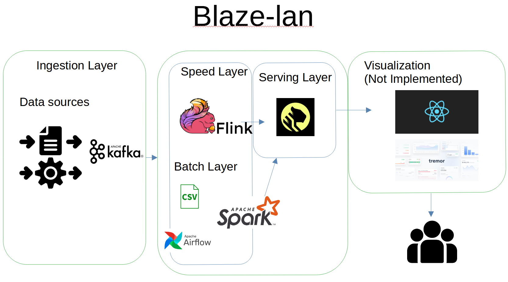

### Introduction
This is a project that builds a lambda architecture streaming data application serving the batch processing, speed processing and serving layer. It has a UI that displays the streaming project

There will be 2 streaming data sources: the first source will go through the batch processing layer for big data processing using spark processing - the batch processing will be triggered via a Airflow Orchestrator. For batch processing, data will be stored as csv files in local directory. The second source will go through the speed layer that aggregates data in real-time. Both speed layer and processing layer will have timescale Database as datasink.

User will access data insights through Visalization Dashboard Build from various Frontend Framework like ReactJs or Dash.

After all the components are finalised, they are packaged into docker images for resuability on dockerhub. A docker-compose.yml will be used at the end to host the applications.

As a second-stage enhancement, the application will be hosted on kubernetes. (To be continued...)

### Architecture Choice
`Messaging Broker: Apache Kafka`
- Why it was chosen?:
    - Scability - A single cluster can span across multiple data centers and cloud facilities. A single topic can place partitions on different brokers. This allows for easy horizontal scaling — just add new servers or data centers to your existing infrastructure to handle a greater amount of data.  
    - High availability and fault tolerance
    - Kafka Connect for simple integration. Using Kafka Connect source and sink to easily move data from one platform to another.
    - There are existing cloud provider like confluent that host managed Kafka Cluster
- Other technologies that has the same functionalities:
    - RabbitMQ
    - MQTT
    - Google Pub/Sub

`Orchestration Tool: Apache Airflow`
- Why it was chosen?:
    - Gold Standard for Data Orchestration (IMO)
    - UI provided for monitoring jobs
    - May scale up clusters if there is a need to.
    - Most Cloud Providers provide a fully-managed version.
    - Open-source and free if you have the expertises to maintain it.
- Other technologies that has the same functionalities:
    - Dagster
    - Luigi
    - Prefect 

`Big Data Processing Engine: Apache Spark`
- Why it was chosen?:
    - Speed - it is optimised for speed in both memory and on disk. Spark performs faster than Hadoop Cluster by  more than 100 times if the data is stored in Spark Cluster's Memory.
    - Simplicity and Maturity of Technology: Well-documented APIs to be used. Able to use for batch and live streaming datasets, perform machine learning tasks etc.
    - Available in Cloud Providers as a Pay-per-use service like AWS EMR, GCP DataProc 
- Other technologies that has the same functionalities:
    - Hadoop

`Speed Layer Processing: Apache Flink`
- Why it was chosen?:
    - Able to reuse pipeline for batch and streaming processing by writing 1 set of code.
    - Parallelism: Processing is parallelized to thousands of tasks, distributed multiple machines, concurrently. State is also partitioned and distributed horizontally, allowing to maintain several terabytes across multiple machines.
    - Rich set of datasource and datasinks to move data from 1 platform to another platform.

`Sink DataBase: TimescaleDB`
- Why it was chosen?:
    - intutitve for developer coming from a structured database background.
    - Hypertables and chunks: optimized for timeseries data storage as hypertable automatically parititions time ranges into specific chunk that speed up query speed. 
- Other technologies that have the same functionality:
    - Cassandra DB
    - Mongo DB
    - kDB

### Overall Architecture

### project structure (to create any directories that is required but not present by default)
.
├── README.md
├── finnhub-data (for kafka to stream data as csv)
├── spark-app (for spark app data)
├── analytics_results (for landing spark analytics results)
├── docker-compose.yml (spinning up kafka cluster, airflow cluster, timescaledb cluster)
├── ingestion (scripts for ingesting API data, apache flink speed layer)
├── orchestration (DAGs and single docker-compose file for spinning up airflow)
├── requirements.txt
├── resources (putting screenshots for README.md)
└── timescaledb_data (To create for timescaleDB to land its backup data.)

### Starting the application
1) do `docker-compose.yml up -d` at the root directory
2) `python -m venv .venv`
3) `.\.venv\Scripts\activate` and then `pip install -r requirements.txt` in a new environment
3) run batch processing scripts: `python3 ingest_finnhub.py` and `python3 consume_finnhub.py`
4) create table for speed processing data
5) run speed processing scripts (second script to directly write to timescaleDB table): `python3 ingest_news.py` and `python3 process_flink.py`