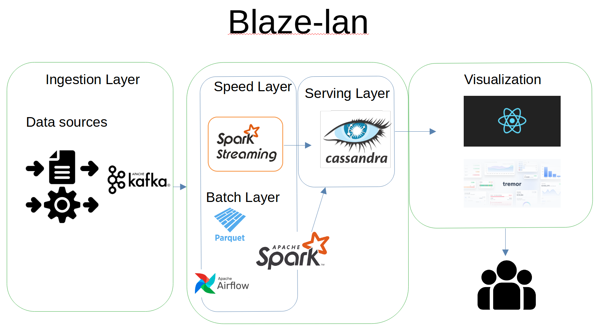

### Introduction
This is a project that builds a lambda architecture streaming data application serving the batch processing, speed processing and serving layer. It has a UI that displays the streaming project

There will be 2 streaming data sources: the first source will go through the batch processing layer for big data processing using spark processing - the batch processing will be triggered via a Airflow Orchestrator. For batch processing, data will be stored as parquet files in AWS S3. The second source will go through the speed layer that aggregates data in real-time. Both speed layer and processing layer will have a database as datasink. The datasink will update in real-time, and frontend which consist of ReactJs will display a dashboard. 

User will access data insights through React Dashboard.

After all the components are finalised, they are packaged into docker images for resuability on dockerhub. A docker-compose.yml will be used at the end to host the applications.

As a second-stage enhancement, the application will be hosted on kubernetes. 

### Overall Architecture

### Starting the application:
1) do `docker-compose.yml up -d` at the root directory
2) pip install -r requirements.txt in a new environment
3) run batch processing scripts: `python3 ingest_finnhub.py` and `python3 consume_finnhub.py`
4) create table for speed processing data
5) run speed processing scripts (second script to directly write to timescaleDB table): `python3 ingest_news.py` and `python3 process_flink.py`